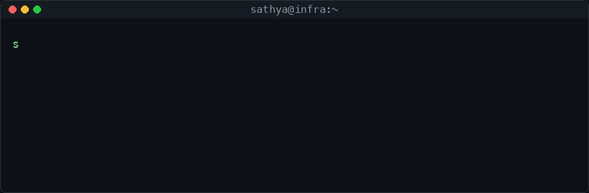

### About Me

🧪 exploring **Agentic AI** &nbsp;·&nbsp; 🔧 GCP and on-prem ☁️ extensive mobile CI/CD experience &nbsp;·&nbsp; 🤖 automate on the third repeat &nbsp;·&nbsp;  🤝

---

  

<!-- 

  

 -->

### 🍱 Tech Stack (Not a Stack, a Buffet)

> It's about picking tools based on the problem, not the trend. :D 

  

### 📫 Let's Connect

  

  

